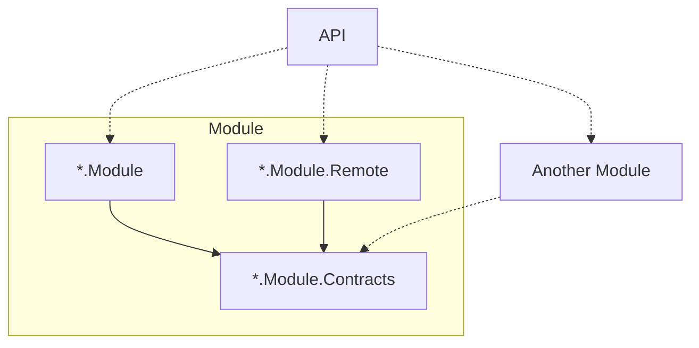

# Principios de Arquitectura

## Estructura del módulo

Cada módulo está compuesto por:

```text
*.Module.Contracts
*.Module
```

## Contracts

Responsabilidades:

- Interfaces públicas
- DTOs públicos (Request/Response)
- Atributos de validación simples y autocontenidos

Reglas:

- No debe referenciar ningún otro módulo
- No debe referenciar otro proyecto Contracts
- No debe contener lógica de implementación
- Debe evitar dependencias orientadas a la implementación

Los Contratos son nodos hoja en el grafo de dependencias.

## Módulo

>Un módulo debería representar una capacidad funcional que tendría sentido desplegar, versionar o extraer de forma independiente en el futuro.

Responsabilidades:

- Funcionalidades
- Componentes compartidos
- Infraestructura
- Registro de endpoints
- Implementaciones de contratos

Reglas:

- Referencia su propio proyecto Contracts
- Puede referenciar otros proyectos Contracts
- No debe referenciar otro Módulo

-------------------------------
### Visibilidad
-------------------------------

Todo dentro de un Módulo debe ser interno por defecto.

El único punto de entrada público es Bootstrap.

De esta forma tenemos aislamiento total sobre el proyecto.

-------------------------------
### Bootstrap
-------------------------------

Bootstrap es el punto de integración entre un módulo y una aplicación anfitriona.

Posibles responsabilidades:

- Registro de inyección de dependencias
- Registro de endpoints
- Registro de servicios hospedados
- Registro de middleware
- Otras preocupaciones de integración específicas del anfitrión

No se impone ninguna interfaz o patrón de implementación requerido.

Esto es debido a que la aplicacion anfitriona puede ser desde un function, api, service, console, etc.

> [!NOTE]
> Un Bootstrap puede contener compatibilidad con multiples formatos de aplicacion anfitriona.

-------------------------------
### Features
-------------------------------

Una Feature representa una capacidad funcional o caso de uso.

Ejemplos:

```text
GetOrder
GetOrders
CreateOrder
CancelOrder
```

esta arquitectura no impone ninguna estructura interna en las Funcionalidades para que el equipo decidad si mantenerlo simple, implementar una estructura de Command/Handler o implementar algun otro diseño.

-------------------------------
### Infrastructure
-------------------------------

Infrastructure contiene las integraciones y detalles técnicos necesarios para que el módulo interactúe con recursos externos o mecanismos de persistencia.

Su responsabilidad es aislar la implementación técnica del resto del módulo.

Cada integracion se debe considerar como una Feature por lo cual todo lo relacionado debe estar contenido en la misma carpeta.

Ejemplo:

```text
Infrastructure
|└─Database
|   └─ IOrderRepository
|   └─ OrderDbContext
└─Notification
|   └─ INotificationService
|   └─ NotificationService
```
-------------------------------
#### Tecnicas Avanzadas
-------------------------------

Seguramente todos los modulos terminen usando el mismo motor de base de datos para persistencia esto podria causar que un modulo a forma de "agilizar" rompa el asilamiento haciendo una query que invada el dominio/tablas de otro modulo. Si deseamos evitar eso lo correcto seria que cada modulo tenga su propio schema de base de datos (que tener una division por schema es barato) y usuarios asigandos especificamente a cada schema para cada modulo.

-------------------------------
### Shared
-------------------------------

Shared contiene elementos reutilizados por múltiples Funcionalidades dentro del mismo módulo.

Si varias Funcionalidades dependen de la misma implementación, esa implementación debe promoverse a Shared.

>[!TIP]
> No creen Shared por defecto, crearlo cuando tenga logica que quieren usar en varios casos de usos como Helpers o Utils.


## Remote

Cuando un módulo requiere escalar independientemente o ser extraído a un repositorio separado, la implementación local puede reemplazarse por una implementación remota.

`*.Module.Remote` tiene la misma responsabilidad funcional y reglas que `*.Module`, pero su implementación delega la ejecución a un servicio remoto.

Puede contener conceptos como

```text
Clients
Serialization
Authentication
Retries
Resilience Policies
Remote Configuration
```

Como los otros `*.Module` consumen el `*.Module.Contract` no se enteran del cambio y solamente la aplicacion anfitriona debe actualizar su dependencia y consumir un nuevo Boostrap que ofrece `*.Module.Remote`.

Este modulo debe respetar la regla de que todo sea `internal` a excepcion del Boostrap que se ofrece para la aplicacion anfitriona.

-------------------------------
### Tecnicas avanzadas
-------------------------------

Si un equipo es lo suficiento maduro al separar un modulo tanto el `*.Module.Contract` y el `*.Module.Remote` pueden convertirse en un paquete nugget, de esta forma se elimina la referencia completamente del proyecto y la evolucion del paquete nugget esta ligado a la evolucion del proyecto.

Esto tambien permite a que nuevos actores que originalmente no eran parte del proyecto original tambien puedan acceder facilmente a este modulo.

Es importante tambien definir una politica de versionado se recomienda que cuando un contrato tenga cambios que rompan compatibilidad con la version actual la nueva version sea una funciona nueva y la que va a quedar deprecada este marcada con `[Obsolete("...")]` para que los consumidores al actualizar esten al tando del cambio.


## Reglas de dependencias

Permitido:

```text
Module -> Module.Contracts
Module -> Other.Module.Contracts
API -> Module
API -> Module.Remote
```

Prohibido:

```text
Module -> Other.Module
Module -> Other.Module.Remote
Contracts -> Anything
Contracts -> Other.Contracts
```

## Diagramas de dependencias

